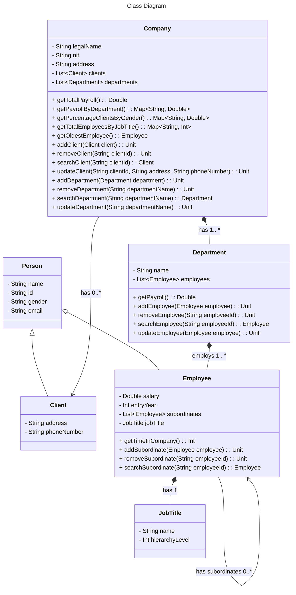

```mermaid
---
title: Class Diagram
---

%% Para visualizar el diagrama, por favor acceda a https://mermaid.live/ e ingrese el siguiente código. %%

classDiagram
    class Person {
        - String name
        - String id
        - String gender
        - String email
    }

    class Client {
        - String address
        - String phoneNumber
    }

    class Employee {
        - Double salary
        - Int entryYear
        - List~Employee~ subordinates
        - JobTitle jobTitle
        + getTimeInCompany(): Int        
        + addSubordinate(Employee employee): Unit
        + removeSubordinate(String employeeId): Unit
        + searchSubordinate(String employeeId): Employee
    }

    class JobTitle {
        - String name
        - Int hierarchyLevel
    }

    class Department {
        - String name
        - List~Employee~ employees
        + getPayroll(): Double
        + addEmployee(Employee employee): Unit
        + removeEmployee(String employeeId): Unit
        + searchEmployee(String employeeId): Employee
        + updateEmployee(Employee employee): Unit
    }

    class Company {
        - String legalName
        - String nit
        - String address
        - List~Client~ clients
        - List~Department~ departments
        + getTotalPayroll(): Double
        + getPayrollByDepartment(): Map~String, Double~
        + getPercentageClientsByGender(): Map~String, Double~
        + getTotalEmployeesByJobTitle(): Map~String, Int~
        + getOldestEmployee(): Employee
        + addClient(Client client): Unit
        + removeClient(String clientId): Unit
        + searchClient(String clientId): Client
        + updateClient(String clientId, String address, String phoneNumber): Unit
        + addDepartment(Department department): Unit
		+ removeDepartment(String departmentName): Unit
		+ searchDepartment(String departmentName): Department
		+ updateDepartment(String departmentName): Unit
    }

    Person <|-- Client
    Person <|-- Employee
    Employee *-- JobTitle : has 1
    Employee --> Employee : has subordinates 0..*
    Department *-- Employee : employs 1.. *
    Company --> Client : has 0..*
    Company *-- Department : has 1.. *
```